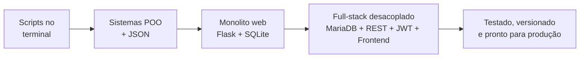

<div align="center">

# 🐍 Python para Iniciantes — Exercícios Guiados

### Do `print("Olá, mundo!")` a sistemas full-stack testados e prontos para produção


     

**[🚀 Como usar](#-como-usar) · [🗺️ A jornada](#%EF%B8%8F-a-jornada) · [📚 Currículo completo](#-currículo-completo) · [🏆 Projetos finais](#-os-7-projetos-finais) · [🔬 Anatomia de um exercício](#-anatomia-de-um-exercício) · [✅ Seu progresso](#-acompanhe-seu-progresso)**

</div>

---

## 💡 Sobre o curso

Um curso completo de programação em **35 semanas de exercícios guiados e gamificados**, entregue em arquivos HTML interativos que funcionam direto no navegador — **sem instalar nada para estudar** (só o Python para praticar!).

A jornada parte do zero absoluto (o que é um algoritmo?) e chega à **engenharia de software profissional**: bancos relacionais com MariaDB, APIs REST autenticadas com JWT, frontend desacoplado, testes automatizados com pytest, Git/GitHub e preparação para produção.

Tudo costurado por um fio condutor: a **☕ Tua Caneca**, uma loja fictícia de canecas personalizadas que evolui junto com você — do primeiro `print` do catálogo ao sistema full-stack completo.

> [!TIP]
> **Cada semana é um arquivo HTML autocontido e gamificado:** barra de XP, progresso salvo no navegador, dicas e soluções recolhíveis, checklist de conclusão e prévia da próxima semana.

## ✨ Destaques

| | |
|---|---|
| 🎮 **Gamificação** | Barra de **XP DA SEMANA** que enche a cada exercício concluído, mensagens de incentivo e banner de conquista 🏆 ao fechar 100% |
| 💾 **Progresso salvo** | Seus checks ficam gravados no navegador (`localStorage`) — feche e volte quando quiser (e o botão ↺ reseta a semana) |
| 🔑 **Soluções escondidas** | Toda solução comentada fica recolhida com o aviso *"Só abra depois de tentar!"* — o esforço vem antes do gabarito |
| 🐛 **Erros propositais** | Bugs plantados de propósito ensinam a LER erros — a habilidade nº 1 de quem programa |
| 🔗 **Callbacks constantes** | Cada semana revisita as anteriores (*"olha a Semana 5 aí!"*) — o conhecimento se acumula, não se empilha |
| ⭐ **Dificuldade progressiva** | Exercícios marcados como ⭐ básico · ⭐⭐ médio · ⭐⭐⭐ desafio |
| ☕ **Fio condutor** | A loja Tua Caneca cresce semana a semana até virar um sistema full-stack de verdade |

## 🚀 Como usar

<details>
<summary><strong>Opção 1 — Estudar localmente (recomendado)</strong></summary>

```bash
git clone https://github.com/SEU-USUARIO/SEU-REPOSITORIO.git
cd SEU-REPOSITORIO
```

Depois é só **dar duplo clique** no arquivo da semana (ex.: `semana-01-logica-e-primeiros-passos.html`) — ele abre no navegador com tudo funcionando. O progresso fica salvo **por navegador**, então estude sempre no mesmo. 😉

</details>

<details>
<summary><strong>Opção 2 — Publicar como site (GitHub Pages)</strong></summary>

1. No repositório: **Settings → Pages → Branch: `main` → Save**
2. Em instantes o curso estará em `https://SEU-USUARIO.github.io/SEU-REPOSITORIO/semana-01-logica-e-primeiros-passos.html`
3. Compartilhe o link com a turma — cada aluno tem seu próprio progresso (o `localStorage` é individual, no navegador de cada um!)

*(Coincidência? Você aprende exatamente isso na [Semana 34](./semana-34-producao-e-deploy.html) 😄)*

</details>

<details>
<summary><strong>Opção 3 — Só espiar, sem clonar</strong></summary>

Cole a URL de qualquer arquivo do repositório em <https://htmlpreview.github.io> para visualizá-lo renderizado direto do GitHub.

</details>

> [!IMPORTANT]
> **Para praticar** você precisa do [Python 3](https://www.python.org/downloads/) instalado e um editor (recomendo o [VS Code](https://code.visualstudio.com/)). As dependências extras de cada fase estão em [🧰 Ferramentas por módulo](#-ferramentas-por-módulo).

## 🗺️ A jornada

```mermaid
flowchart LR
    M1["🧱 Fundamentos<br/>Semanas 1-8"] --> M2["🧬 POO & Dados<br/>Semanas 9-12"]
    M2 --> M3["🌍 Mundo Real<br/>Semanas 13-16"]
    M3 --> M4["📊 Dados & Web<br/>Semanas 17-20"]
    M4 --> M5["🗄️ Bancos & Web<br/>Semanas 21-25"]
    M5 --> M6["🏛️ Full-Stack<br/>Semanas 26-30"]
    M6 --> M7["🏗️ Engenharia<br/>Semanas 31-35"]
    style M1 fill:#FFD43B,color:#1a1a1a
    style M2 fill:#ffe27a,color:#1a1a1a
    style M3 fill:#a8d1f0,color:#1a1a1a
    style M4 fill:#7fbce8,color:#1a1a1a
    style M5 fill:#5aa7de,color:#fff
    style M6 fill:#3776AB,color:#fff
    style M7 fill:#28577e,color:#fff
```



E a evolução da arquitetura que você constrói:



## 📚 Currículo completo

**467 exercícios** distribuídos em 35 semanas. Clique em cada módulo para expandir:

<details>
<summary><strong>🧱 Módulo 1 — Fundamentos</strong> · Semanas 1–8 · 149 exercícios</summary>

> A base de toda a programação: lógica, decisões, repetições, coleções e funções — coroada pelo primeiro sistema completo.

| Semana | Aula | O que você domina | Ex. |
|:---:|---|---|:---:|
| **01** | [Lógica e Primeiros Passos com Python](./semana-01-logica-e-primeiros-passos.html) | `print`, variáveis, `input`, f-strings — as primeiras linhas de código | 25 |
| **02** | [Condicionais](./semana-02-condicionais.html) | `if`/`elif`/`else`, comparações, `and`/`or` — o código que decide | 21 |
| **03** | [Loops e Repetições](./semana-03-loops-repeticoes.html) | `while`, `for`, `range`, acumuladores — o código que repete | 22 |
| **04** | [Listas e Strings](./semana-04-listas-e-strings.html) | métodos de lista e string, fatias, `in`, `sort` — coleções na prática | 20 |
| **05** | [Dicionários e Tuplas](./semana-05-dicionarios-e-tuplas.html) | dicionários, `.get`, tuplas, desempacotar, dict contador | 18 |
| **06** | [Funções](./semana-06-funcoes.html) | `def`, parâmetros, `return`, valores padrão — o princípio DRY | 17 |
| **07** | [Erros e Arquivos](./semana-07-erros-e-arquivos.html) | `try`/`except`, `raise`, `open`, `with` — programas à prova de falhas | 16 |
| **08** | [Projeto Final](./semana-08-projeto-final.html) | 🏆 Sistema Tua Caneca no terminal: menu, estoque, vendas e relatório | 10 |

</details>

<details>
<summary><strong>🧬 Módulo 2 — POO & Dados</strong> · Semanas 9–12 · 53 exercícios</summary>

> O salto de organização: módulos, orientação a objetos, herança e persistência em JSON.

| Semana | Aula | O que você domina | Ex. |
|:---:|---|---|:---:|
| **09** | [Módulos e Bibliotecas](./semana-09-modulos-e-bibliotecas.html) | `import`, `random`, `datetime`, `time`, `pip` — o arsenal do Python | 16 |
| **10** | [Classes e Objetos](./semana-10-classes-e-objetos.html) | POO: classes, `__init__`, atributos e métodos — objetos que se cuidam | 14 |
| **11** | [Herança e JSON](./semana-11-heranca-e-json.html) | herança, `super()`, `json.dumps`/`loads` — hierarquias e persistência | 13 |
| **12** | [Projeto Final 2](./semana-12-projeto-final-2.html) | 🏆 Sistema orientado a objetos com persistência em JSON | 10 |

</details>

<details>
<summary><strong>🌍 Módulo 3 — Mundo Real</strong> · Semanas 13–16 · 46 exercícios</summary>

> Python encontra o SEU computador e a internet: planilhas, automação de arquivos e APIs.

| Semana | Aula | O que você domina | Ex. |
|:---:|---|---|:---:|
| **13** | [CSV e Planilhas](./semana-13-csv-e-planilhas.html) | `csv.reader`/`writer`, `DictReader` — planilhas encontram o Python | 13 |
| **14** | [Automações](./semana-14-automacoes.html) | `os`, `shutil`, `pathlib`, dry run — o computador trabalha por você | 12 |
| **15** | [APIs e Internet](./semana-15-apis-e-internet.html) | `requests`, APIs públicas, JSON da web, `timeout` — dados da internet | 11 |
| **16** | [Projeto Final 3](./semana-16-projeto-final-3.html) | 🏆 Automação completa: arquivos + APIs + relatórios do mundo real | 10 |

</details>

<details>
<summary><strong>📊 Módulo 4 — Dados & Web</strong> · Semanas 17–20 · 45 exercícios</summary>

> Análise com pandas, visualização com matplotlib e as primeiras páginas com Flask.

| Semana | Aula | O que você domina | Ex. |
|:---:|---|---|:---:|
| **17** | [Análise de Dados com pandas](./semana-17-pandas.html) | pandas: DataFrame, filtros, `groupby`, `sort_values` — dados em escala | 14 |
| **18** | [Gráficos com matplotlib](./semana-18-graficos-matplotlib.html) | matplotlib: barras, linhas, pizza, subplots, salvar PNG | 11 |
| **19** | [Web com Flask](./semana-19-web-com-flask.html) | Flask: rotas, HTML, rotas dinâmicas, `jsonify` — sua primeira página | 10 |
| **20** | [Projeto Final 4](./semana-20-projeto-final-4.html) | 🏆 Dashboard web: dados + gráficos + Flask num painel vivo | 10 |

</details>

<details>
<summary><strong>🗄️ Módulo 5 — Bancos & Web Dinâmica</strong> · Semanas 21–25 · 63 exercícios</summary>

> SQL do zero ao GROUP BY, apps web com banco, integração com IA — e o grande sistema monolítico.

| Semana | Aula | O que você domina | Ex. |
|:---:|---|---|:---:|
| **21** | [Banco de Dados com SQLite](./semana-21-banco-sqlite.html) | SQLite: `CREATE`, `INSERT`, `SELECT`, `WHERE` e a lição sagrada dos placeholders | 15 |
| **22** | [SQL a Fundo (CRUD)](./semana-22-sql-crud.html) | CRUD completo: `UPDATE`, `DELETE`, `ORDER BY`, `LIKE`, agregações e `GROUP BY` | 14 |
| **23** | [Flask + Banco de Dados](./semana-23-flask-e-banco.html) | formulários POST, `request.form`, POST-redirect-GET, CRUD pela web | 12 |
| **24** | [Python e IA](./semana-24-python-e-ia.html) | APIs de IA com `requests`: chave segura em `os.environ`, prompts e IA→JSON | 12 |
| **25** | [Projeto Final 5](./semana-25-projeto-final-5.html) | 🏆 Loja Tua Caneca Web: o sistema monolítico completo (o "antes") | 10 |

</details>

<details>
<summary><strong>🏛️ Módulo 6 — Full-Stack Desacoplado</strong> · Semanas 26–30 · 56 exercícios</summary>

> A arquitetura profissional: MariaDB gerenciado no DBeaver, API REST, autenticação JWT e frontend separado.

| Semana | Aula | O que você domina | Ex. |
|:---:|---|---|:---:|
| **26** | [MariaDB e DBeaver](./semana-26-mariadb-e-dbeaver.html) | MariaDB + DBeaver: do arquivo ao servidor, PyMySQL, `%s` e a migração | 13 |
| **27** | [API REST com Flask](./semana-27-api-rest.html) | API REST: verbos HTTP, JSON, status codes, validação e CORS | 13 |
| **28** | [Autenticação com JWT](./semana-28-autenticacao-jwt.html) | JWT: hash de senha, login com token, `@token_required` e erros 401 | 10 |
| **29** | [Frontend Desacoplado](./semana-29-frontend-desacoplado.html) | frontend separado: `fetch`, `async/await`, `localStorage` e `Bearer` | 10 |
| **30** | [Projeto Final 6](./semana-30-projeto-final-6.html) | 🏆 Sistema full-stack desacoplado: MariaDB + API + JWT + frontend | 10 |

</details>

<details>
<summary><strong>🏗️ Módulo 7 — Engenharia de Software</strong> · Semanas 31–35 · 55 exercícios</summary>

> O que torna código confiável: JOINs e modelagem, testes automatizados, Git/GitHub e produção.

| Semana | Aula | O que você domina | Ex. |
|:---:|---|---|:---:|
| **31** | [SQL Avançado: JOINs](./semana-31-sql-joins.html) | `FOREIGN KEY`, `INNER`/`LEFT JOIN`, `HAVING`, três tabelas e relatórios | 13 |
| **32** | [Testes com pytest](./semana-32-testes-pytest.html) | pytest: `assert`, bordas, `raises`, `parametrize` e `test_client` na API | 11 |
| **33** | [Git e GitHub](./semana-33-git-e-github.html) | Git: commits, `.gitignore`, GitHub, `push`, branches e o README | 10 |
| **34** | [Produção e Deploy](./semana-34-producao-e-deploy.html) | `requirements.txt`, venv, `.env`, debug off, WSGI e Docker | 11 |
| **35** | [Projeto Final 7](./semana-35-projeto-final-7.html) | 🏆 Engenharia de ponta a ponta: JOINs + testes + Git + produção + deploy | 10 |

</details>

## 🏆 Os 7 projetos finais

Cada módulo fecha com um projeto que **integra tudo** o que veio antes — sempre construindo a loja Tua Caneca em um novo patamar:

| # | Semana | Projeto | Integra |
|:---:|:---:|---|---|
| 1 | [08](./semana-08-projeto-final.html) | **Sistema Tua Caneca no terminal** | menus, listas, dicionários e funções |
| 2 | [12](./semana-12-projeto-final-2.html) | **Sistema POO + JSON** | classes, herança e persistência |
| 3 | [16](./semana-16-projeto-final-3.html) | **Central de automação** | CSV + arquivos + APIs + relatórios |
| 4 | [20](./semana-20-projeto-final-4.html) | **Dashboard web** | pandas + matplotlib + Flask |
| 5 | [25](./semana-25-projeto-final-5.html) | **Loja Tua Caneca Web** | o monolito completo com SQLite |
| 6 | [30](./semana-30-projeto-final-6.html) | **Sistema desacoplado** | MariaDB + API REST + JWT + frontend |
| 7 | [35](./semana-35-projeto-final-7.html) | **Engenharia completa** | JOINs + pytest + Git + produção |

## 🔬 Anatomia de um exercício

Todos os exercícios seguem a mesma estrutura pedagógica:

```
🎯 Objetivo        → o que você vai dominar
🧭 Passo a passo   → o caminho, sem entregar o código
💻 Código inicial  → janelas de terminal com lacunas ____ para completar
✅ Saída esperada  → confira se o seu resultado bate
💡 Dica            → recolhida — abra só se emperrar
🚀 Desafio extra   → para quem quer ir além
🔑 Solução         → comentada e recolhida ("Só abra depois de tentar!")
```

> [!WARNING]
> **Regra de ouro do curso: DIGITE o código, não copie e cole.** A memória muscular de escrever (e errar, e corrigir) é onde o aprendizado acontece de verdade.

## 🧰 Ferramentas por módulo

| Módulo | Novidades na caixa de ferramentas | Instalação |
|---|---|---|
| 🧱 1-2 (S1-12) | Python puro — nada a instalar | [python.org](https://python.org) |
| 🌍 3 (S13-16) | requests | `pip install requests` |
| 📊 4 (S17-20) | pandas · matplotlib · Flask | `pip install pandas matplotlib flask` |
| 🗄️ 5 (S21-25) | sqlite3 (já vem com o Python!) · API de IA opcional | — |
| 🏛️ 6 (S26-30) | **MariaDB** · **DBeaver** · PyMySQL · PyJWT · flask-cors | `pip install pymysql pyjwt flask-cors` + [MariaDB](https://mariadb.org) + [DBeaver](https://dbeaver.io) |
| 🏗️ 7 (S31-35) | pytest · python-dotenv · waitress · **Git** | `pip install pytest python-dotenv waitress` + [git-scm.com](https://git-scm.com) |

## ✅ Acompanhe seu progresso

> Faça um **fork** deste repositório e marque as semanas conforme concluir! *(Dentro de cada semana, o progresso fino — exercício a exercício — é salvo automaticamente no navegador.)*

**🧱 Fundamentos**
- [ ] Semana 01 — Lógica e Primeiros Passos com Python *(25 ex.)*
- [ ] Semana 02 — Condicionais *(21 ex.)*
- [ ] Semana 03 — Loops e Repetições *(22 ex.)*
- [ ] Semana 04 — Listas e Strings *(20 ex.)*
- [ ] Semana 05 — Dicionários e Tuplas *(18 ex.)*
- [ ] Semana 06 — Funções *(17 ex.)*
- [ ] Semana 07 — Erros e Arquivos *(16 ex.)*
- [ ] Semana 08 — Projeto Final *(10 ex.)*

**🧬 POO & Dados**
- [ ] Semana 09 — Módulos e Bibliotecas *(16 ex.)*
- [ ] Semana 10 — Classes e Objetos *(14 ex.)*
- [ ] Semana 11 — Herança e JSON *(13 ex.)*
- [ ] Semana 12 — Projeto Final 2 *(10 ex.)*

**🌍 Mundo Real**
- [ ] Semana 13 — CSV e Planilhas *(13 ex.)*
- [ ] Semana 14 — Automações *(12 ex.)*
- [ ] Semana 15 — APIs e Internet *(11 ex.)*
- [ ] Semana 16 — Projeto Final 3 *(10 ex.)*

**📊 Dados & Web**
- [ ] Semana 17 — Análise de Dados com pandas *(14 ex.)*
- [ ] Semana 18 — Gráficos com matplotlib *(11 ex.)*
- [ ] Semana 19 — Web com Flask *(10 ex.)*
- [ ] Semana 20 — Projeto Final 4 *(10 ex.)*

**🗄️ Bancos & Web Dinâmica**
- [ ] Semana 21 — Banco de Dados com SQLite *(15 ex.)*
- [ ] Semana 22 — SQL a Fundo (CRUD) *(14 ex.)*
- [ ] Semana 23 — Flask + Banco de Dados *(12 ex.)*
- [ ] Semana 24 — Python e IA *(12 ex.)*
- [ ] Semana 25 — Projeto Final 5 *(10 ex.)*

**🏛️ Full-Stack Desacoplado**
- [ ] Semana 26 — MariaDB e DBeaver *(13 ex.)*
- [ ] Semana 27 — API REST com Flask *(13 ex.)*
- [ ] Semana 28 — Autenticação com JWT *(10 ex.)*
- [ ] Semana 29 — Frontend Desacoplado *(10 ex.)*
- [ ] Semana 30 — Projeto Final 6 *(10 ex.)*

**🏗️ Engenharia de Software**
- [ ] Semana 31 — SQL Avançado: JOINs *(13 ex.)*
- [ ] Semana 32 — Testes com pytest *(11 ex.)*
- [ ] Semana 33 — Git e GitHub *(10 ex.)*
- [ ] Semana 34 — Produção e Deploy *(11 ex.)*
- [ ] Semana 35 — Projeto Final 7 *(10 ex.)*

## 🎓 Metodologia

- **Mão na massa desde o minuto 1** — teoria mínima, prática máxima, sempre com saída esperada para conferência
- **Erros como professores** — bugs plantados de propósito ensinam a ler tracebacks sem pânico
- **Espiral de revisão** — os callbacks entre semanas fazem cada conceito ser reencontrado em contextos novos
- **Projeto como destino** — a cada 4-5 semanas, um sistema completo prova que as peças se encaixam
- **Segurança desde o início** — placeholders contra SQL injection, senhas com hash, segredos em `.env`: boas práticas ensinadas como hábito, não como remendo
- **Arquitetura com propósito** — o curso constrói o monolito de propósito… para depois desacoplá-lo, e você entender o PORQUÊ de cada escolha

## 📁 Estrutura do repositório

```
.
├── README.md                                  ← você está aqui
├── semana-01-logica-e-primeiros-passos.html   ← comece por aqui!
├── semana-02-condicionais.html
├── ...
└── semana-35-projeto-final-7.html             ← a formatura 🎓
```

## 🤝 Contribuindo

Achou um erro? Tem uma ideia de exercício? **Issues e PRs são muito bem-vindos!** Sugestões de como contribuir:

1. Abra uma *issue* descrevendo o problema/ideia (indique a semana e o número do exercício)
2. Para PRs: uma mudança por PR, com mensagem de commit clara *(você aprende isso na [Semana 33](./semana-33-git-e-github.html) 😄)*

---

<div align="center">

**35 semanas · 467 exercícios · 7 projetos · 1 jornada**

Feito com ☕ e 🐍 — *bons códigos para a vida toda!*

⭐ **Se este material te ajudou, deixe uma estrela no repositório!** ⭐

</div>